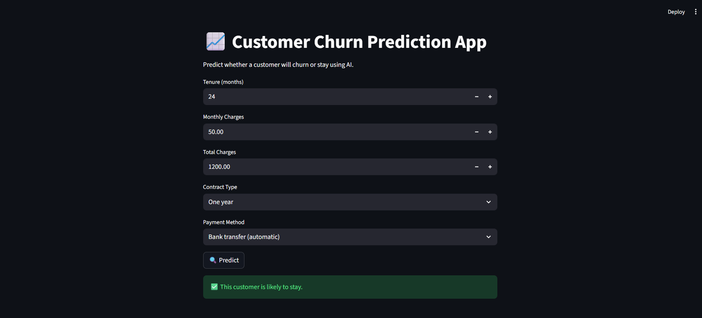
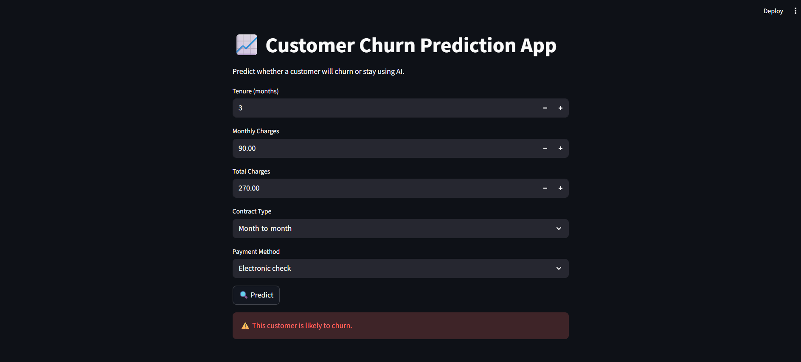

# 📈 Customer Churn Prediction using Machine Learning

This project predicts whether a customer will **churn (leave)** or **stay** based on demographic and service usage data.  
It includes **data preprocessing, exploratory data analysis (EDA), model training, evaluation, and deployment** with a **Streamlit web app**.

---

## 🚀 Project Structure

```
Customer_Churn_Prediction/
│
├── data/
│ └── churn_data.csv
│
├── models/
│ ├── churn_model.h5
│ ├── scaler.pkl
│ └── label_encoders.pkl
│
├── Notebook/
│ └── churn_analysis.ipynb
│
├── app.py
├── requirements.txt
└── README.md
```


---

## 📊 Dataset

- **Dataset Source:** [Kaggle - Telco Customer Churn](https://www.kaggle.com/blastchar/telco-customer-churn)  
- **Rows:** 7043  
- **Columns:** 21  
- **Target Variable:** `Churn` (Yes / No)

**Features include:**
- `gender`, `SeniorCitizen`, `Partner`, `Dependents`
- `tenure`, `MonthlyCharges`, `TotalCharges`
- `InternetService`, `Contract`, `PaymentMethod`
- etc.

---

## 🧠 Workflow Overview

### 1️⃣ Data Preprocessing
- Handle missing values  
- Encode categorical features  
- Scale numerical features using `StandardScaler`  
- Split data into **train/test** sets  

### 2️⃣ Exploratory Data Analysis (EDA)
- Churn distribution  
- Correlation heatmap  
- Contract & Payment type insights  
- Tenure vs Churn analysis  

### 3️⃣ Model Building
- Built with **TensorFlow/Keras (Sequential Model)**  
- Layers: Dense → Dropout → Dense → Sigmoid  
- Optimizer: Adam  
- Loss: Binary Crossentropy  
- Metrics: Accuracy  

### 4️⃣ Model Evaluation
- Accuracy, Precision, Recall, F1-score  
- Confusion Matrix  
- ROC-AUC Curve  

### 5️⃣ Deployment (Streamlit App)
- User-friendly web interface  
- Input fields for key features  
- Real-time churn prediction  

---

## 🧰 Technologies Used

| Category | Tools |
|-----------|--------|
| **Language** | Python |
| **Libraries** | pandas, numpy, scikit-learn, tensorflow, matplotlib, seaborn |
| **Web Framework** | Streamlit |
| **Model Storage** | Pickle & H5 |
| **IDE / Notebook** | Jupyter Notebook |

---

## 🖼 Screenshots

### 🧾 Churn [Yes]


### 🧾 Churn [No]


---

## Example Outputs

- ⚠️ This customer is likely to churn.
- ✅ This customer is likely to stay.

---

## 🔍 How It Works

1. Data Input:
    - Users enter key customer details such as tenure, monthly charges, total charges, contract type, and payment method through the Streamlit interface.

2. Feature Transformation:
    - Inputs are numerically encoded and standardized using the same scaler trained during model development.
    - This ensures consistent feature scaling and prevents bias in predictions.

3. Model Prediction:
    - The pre-trained TensorFlow deep learning model (churn_model.h5) takes these processed inputs.
    - It outputs a probability score (0–1) representing how likely the customer is to churn.

4. Decision Logic:
    - If the churn probability > 0.5 → ⚠️ Customer likely to churn
    - Else → ✅ Customer likely to stay

5. Result Display:
    - The app gives an immediate visual feedback with color-coded results, making it intuitive even for non-technical users.

---

## 🔗 Connect with Me

**Kadulla Pravalika**
- GitHub: [Kadulla-Pravalika-28](https://github.com/Kadulla-Pravalika-28)  
- LinkedIn: [linkedin.com/in/kadulla-pravalika](https://www.linkedin.com/in/kadulla-pravalika/)  

---

## 📄 License

This project is licensed under the **MIT License** – See the [LICENSE](./LICENSE) file for details.
